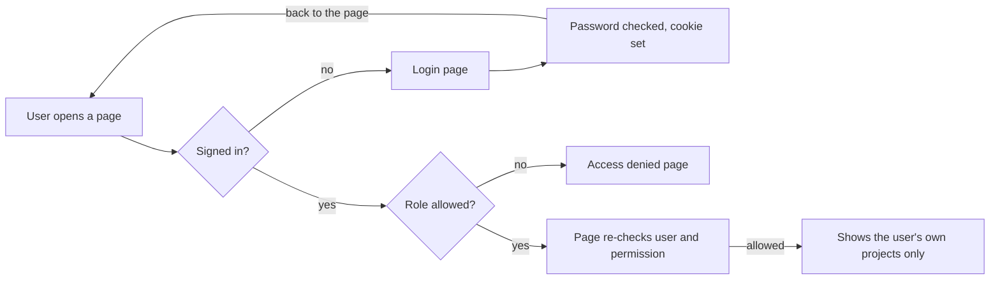

# ProjectHub PM Dashboard: Overview

*As of October 5, 2026 · Arafat*

ProjectHub is a project management dashboard where each person sees and does only what their role allows. It is a working product: data is saved in a real database, and people can create projects and tasks, move them on a Kanban board, comment, invite teammates and manage their accounts. Deployment to a live URL is the one step left.

## At a glance

The code is in the private GitHub repo [Arafat01-coder/pm-dashboard](https://github.com/Arafat01-coder/pm-dashboard).

| Phase | What was delivered | Status |
| --- | --- | --- |
| 1. Foundation | Five roles, permission matrix, frontend with reusable components, login/logout with role-based access | Done |
| 2. Review | Structure and overview shared with the manager | Done |
| 3. Real database | Prisma + SQLite with 8 tables, migrations and demo seed data | Done |
| 4. Working features | Create/edit/delete projects and tasks, project and task detail pages, Kanban board, comments | Done |
| 5. Users and accounts | Invite by link, change roles, deactivate users, forgot/reset password, change password, edit profile | Done |
| 6. Polish and launch | Search and filters, success/error messages, activity log, reports by person | Done, except going live (needs a hosting account and production database) |

Tested: the production build passes, and an 84-check end-to-end test covers every role's permissions, all create/edit/delete actions, invites, password reset and deactivation.

| Layer | Technology | Why |
| --- | --- | --- |
| Language | TypeScript | Catches mistakes before the code runs |
| Frontend | React 19 + Next.js 16 | Pages, routing and server rendering in one framework |
| Styling | CSS Modules | Plain CSS, scoped to each component, no clashes |
| Backend | Node.js (Next.js API routes) | Login, logout and data endpoints live in the same project |
| Auth | JWT (jose) + bcrypt | Signed session tokens and safely hashed passwords |
| Database | Prisma + SQLite | Type-safe database access; SQLite needs no setup and switches to PostgreSQL for production |

## Who uses it

There are five roles, from full control down to read-only. Each user has exactly one role.

| Role | Typical person | What they do in ProjectHub | Projects they see |
| --- | --- | --- | --- |
| Super Admin | Company owner | Everything, including billing and organization settings | All |
| Admin | Operations or management | Manages users, roles and all projects; everything except billing | All |
| Project Manager | Leads a project | Creates and runs projects, assigns tasks, sees the team and reports | Only their own |
| Team Member | Developer, designer | Works on tasks: creates tasks and updates their status | Only their own |
| Client | External stakeholder | Follows progress, read-only | Only their own |

"Their own" means projects the person has been added to as a member.

## Permission matrix

The code checks permissions, never role names. A permission is written as `resource:action`, for example `project:create`. To add a role later, you edit one file (`src/lib/permissions.ts`) and nothing else.

| Permission | Super Admin | Admin | Project Manager | Team Member | Client |
| --- | :-: | :-: | :-: | :-: | :-: |
| View dashboard | Yes | Yes | Yes | Yes | Yes |
| View projects | Yes | Yes | Yes | Yes | Yes |
| View all projects (not only own) | Yes | Yes | | | |
| Create / edit projects | Yes | Yes | Yes | | |
| Delete projects | Yes | Yes | | | |
| View tasks | Yes | Yes | Yes | Yes | Yes |
| Create tasks | Yes | Yes | Yes | Yes | |
| Edit / delete tasks | Yes | Yes | Yes | | |
| Update task status | Yes | Yes | Yes | Yes | |
| View team | Yes | Yes | Yes | | |
| Comment on tasks | Yes | Yes | Yes | Yes | |
| Invite users, change roles, deactivate | Yes | Yes | | | |
| View reports | Yes | Yes | Yes | | |
| View activity log | Yes | Yes | Yes | Yes | Yes |
| Organization settings | Yes | Yes | | | |
| Billing | Yes | | | | |

## Pages

The sidebar only lists pages the user can open. If someone types the address of a page they cannot access, they see an "Access denied" page.

| Page | Address | Who can open it | What it shows |
| --- | --- | --- | --- |
| Login | /login | Everyone | Email and password form, "Forgot password?" link |
| Forgot / reset password | /forgot-password, /reset-password/... | Everyone | Get a one-time link, set a new password |
| Accept invite | /invite/... | Whoever has the link | Set name and password to join |
| Dashboard | /dashboard | All roles | Stats incl. overdue, my open tasks, project progress, recent activity, team workload (managers) |
| Projects | /projects | All roles | Search and filter; create a project (managers) |
| Project details | /projects/... | Project members, admins | Tasks, members, progress, activity; edit, delete, add tasks |
| Tasks | /tasks | All roles | Search and filter by status, priority, assignee, project; change status inline |
| Task board | /tasks/board | All roles | Kanban columns; drag cards to change status |
| Task details | /tasks/... | Project members, admins | Description, details, comments; edit, delete |
| Team | /team | Super Admin, Admin, Project Manager | People and roles; admins invite, change roles, deactivate |
| Reports | /reports | Super Admin, Admin, Project Manager | Completion rate, overdue, by status, by project, by person |
| Settings | /settings | All roles | Edit profile, change password, see own permissions |
| Access denied | /forbidden | All roles | Shown when a role opens a page it cannot access |

Every page works on phones: below 960px wide the sidebar becomes a slide-out menu.

## How sign-in and access checks work

Every page request is checked twice before any data is shown.

The proxy (`src/proxy.ts`) makes the first check before the page loads; the page itself checks again, so a stale or tampered session never reaches data. API endpoints run the same permission check and answer "401 Not authenticated" or "403 Forbidden" instead of redirecting.

On login, the server compares the password with its bcrypt hash and, if it matches, stores a signed token (JWT) in an httpOnly cookie. Logout clears that cookie. Sessions expire after 8 hours.

## How the code is organized

Each folder has one job, so new features slot in without touching unrelated code. All code is under `src/`.

| Folder or file | What lives there |
| --- | --- |
| `app/(auth)/login` | The login page and form |
| `app/(dashboard)` | The signed-in area: shared layout plus the Dashboard, Projects, Tasks, Team, Reports and Settings pages |
| `app/api` | Server endpoints: login, logout, current user, projects |
| `components/ui` | Reusable building blocks: Button, Input, Card, Badge, Table, StatCard and others |
| `components/layout` | Sidebar, top bar, user menu, and the shell that holds them |
| `context/AuthContext.tsx` | Login state for the browser: who is signed in, `login()`, `logout()`, `can()` |
| `lib/permissions.ts` | The role-to-permission map: the single source of truth for access |
| `lib/auth` | Session tokens, password hashing, server-side checks, login rate limit |
| `services` | All database access and business rules (who may edit what); pages never query the database directly |
| `features` | Interactive pieces: project/task forms, Kanban board, comments, team actions, settings forms |
| `prisma/` (project root) | Database tables (`schema.prisma`), migrations, demo data (`seed.ts`) |
| `config/navigation.ts` | Sidebar links and the permission each one needs |
| `proxy.ts` | Runs before every page request and blocks signed-out or unauthorized users |

## How to run it locally

You need Node.js installed. In a terminal, from the project folder:

1. Install the packages (first time only): `npm install`
2. Create the settings file (first time only): copy `.env.example` to `.env.local` and set `JWT_SECRET` to a long random string.
3. Create the database and demo data (first time only): `npm run db:migrate`, then `npm run db:seed`
4. Start the app: `npm run dev`
5. Open http://localhost:3000 and click a demo account on the login page. Every demo account uses the password `Password123!`

To reset all data back to the demo data at any time: `npm run db:seed`.

On Windows PowerShell, if npm is blocked by the script policy, use `npm.cmd run dev` instead.

| Demo role | Email |
| --- | --- |
| Super Admin | owner@demo.dev |
| Admin | admin@demo.dev |
| Project Manager | pm@demo.dev |
| Team Member | member@demo.dev |
| Client | client@demo.dev |

## What's left, and open questions

| Item | What it needs |
| --- | --- |
| Go live | A hosting account (e.g. Vercel) and a hosted PostgreSQL database; steps are in the README |
| Real emails | An email service (Resend, SendGrid, SES...). Until then, invite links are shown to the admin and reset links are printed in the server terminal |

Questions for the team:

- [ ] Production database: PostgreSQL recommended. OK?
- [ ] Should clients log in, or receive shared read-only links instead?
- [ ] Can one person have different roles in different projects (PM on one, member on another)?
- [ ] Is sign-up open, or invite-only? (Current design: invite-only.)
- [ ] Will we need Google or Microsoft sign-in later?
- [ ] Which email service should send invites and password resets?
- [ ] Where should it be hosted?

## Questions people will ask

**Why check permissions instead of roles?** So a new role needs one edit in `permissions.ts`. If the code said "if admin", every such line would need changing.

**Where is the login token kept?** In an httpOnly cookie. Browser JavaScript cannot read it, so a malicious script cannot steal it.

**Is hiding a button enough security?** No. Hiding is only for a clean UI. Every page and API endpoint checks the permission on the server, so a Client calling the API directly still gets "403 Forbidden".

**What happens if a user is deactivated while logged in?** Each request reloads the user from the database, so access stops on their next click.

**Can a Team Member change anything on a task?** Only its status (and they can comment). Changing the title, assignee, priority or due date needs a Project Manager or Admin. This is checked on the server, not just hidden in the UI.

**How do invites work without email?** The admin creates the invitation and gets a one-time link to send (by chat, for example). The link expires after 7 days and works once. When an email service is connected, the same link is emailed automatically.

**What happens when the session expires?** After 8 hours (configurable) the token stops working and the user is sent to the login page, then back to the page they wanted after signing in.

**Can someone guess passwords?** After 5 failed attempts, that email is locked for 15 minutes. The error message never says whether the email exists.

**How hard is it to move to PostgreSQL?** Change one line in `prisma/schema.prisma` and the database adapter in `src/lib/db.ts`, then run the migration. Pages and services stay the same.

**How do we add a new page?** Create the page, protect it with `requirePermission("...")`, and add one line to `config/navigation.ts` so it appears in the sidebar for the right roles.
