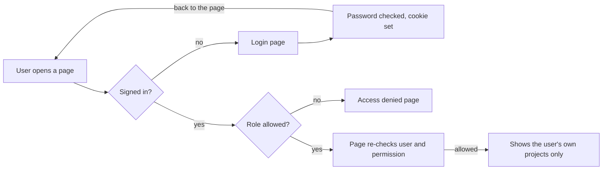

# ProjectHub PM Dashboard: Overview

*As of October 5, 2026 · Arafat*

ProjectHub is a project management dashboard where each person sees and does only what their role allows. Phase 1 is done: the structure is defined, the frontend is built, and login/logout with role-based access works. Data is still sample data until the team picks a database.

## At a glance

All three phase 1 tasks are complete, and the code is in the private GitHub repo [Arafat01-coder/pm-dashboard](https://github.com/Arafat01-coder/pm-dashboard).

| Task | What was delivered | Status |
| --- | --- | --- |
| 1. Dashboard structure | Five roles, a permission matrix, page list, user flows, draft data model ([STRUCTURE.md](STRUCTURE.md)) | Done |
| 2. Frontend | 8 pages, a shared component library, a responsive layout with mobile menu, automatic dark mode | Done |
| 3. Authentication | Login/logout, protected pages, role-based access, session expiry, login rate limit | Done |

Tested: the production build passes, and login, page access and logout were checked for all five roles.

| Layer | Technology | Why |
| --- | --- | --- |
| Language | TypeScript | Catches mistakes before the code runs |
| Frontend | React 19 + Next.js 16 | Pages, routing and server rendering in one framework |
| Styling | CSS Modules | Plain CSS, scoped to each component, no clashes |
| Backend | Node.js (Next.js API routes) | Login, logout and data endpoints live in the same project |
| Auth | JWT (jose) + bcrypt | Signed session tokens and safely hashed passwords |
| Data | In-memory sample data | Placeholder until a database is chosen |

## Who uses it

There are five roles, from full control down to read-only. Each user has exactly one role.

| Role | Typical person | What they do in ProjectHub | Projects they see |
| --- | --- | --- | --- |
| Super Admin | Company owner | Everything, including billing and organization settings | All |
| Admin | Operations or management | Manages users, roles and all projects; everything except billing | All |
| Project Manager | Leads a project | Creates and runs projects, assigns tasks, sees the team and reports | Only their own |
| Team Member | Developer, designer | Works on tasks: creates tasks and updates their status | Only their own |
| Client | External stakeholder | Follows progress, read-only | Only their own |

"Their own" means projects the person has been added to as a member.

## Permission matrix

The code checks permissions, never role names. A permission is written as `resource:action`, for example `project:create`. To add a role later, you edit one file (`src/lib/permissions.ts`) and nothing else.

| Permission | Super Admin | Admin | Project Manager | Team Member | Client |
| --- | :-: | :-: | :-: | :-: | :-: |
| View dashboard | Yes | Yes | Yes | Yes | Yes |
| View projects | Yes | Yes | Yes | Yes | Yes |
| View all projects (not only own) | Yes | Yes | | | |
| Create / edit projects | Yes | Yes | Yes | | |
| Delete projects | Yes | Yes | | | |
| View tasks | Yes | Yes | Yes | Yes | Yes |
| Create tasks | Yes | Yes | Yes | Yes | |
| Edit / delete tasks | Yes | Yes | Yes | | |
| Update task status | Yes | Yes | Yes | Yes | |
| View team | Yes | Yes | Yes | | |
| Invite users, change roles | Yes | Yes | | | |
| View reports | Yes | Yes | Yes | | |
| Organization settings | Yes | Yes | | | |
| Billing | Yes | | | | |

## Pages

The sidebar only lists pages the user can open. If someone types the address of a page they cannot access, they see an "Access denied" page.

| Page | Address | Who can open it | What it shows |
| --- | --- | --- | --- |
| Login | /login | Everyone | Email and password form with validation and error messages |
| Dashboard | /dashboard | All roles | Stats, my open tasks, project progress; a team workload card for roles that can view reports |
| Projects | /projects | All roles | Project list with status, progress, owner and due date; "New project" button for those who can create |
| Tasks | /tasks | All roles | Task list with assignee, priority, status and due date; "New task" button for those who can create |
| Team | /team | Super Admin, Admin, Project Manager | People, their roles and status; "Invite member" button for admins |
| Reports | /reports | Super Admin, Admin, Project Manager | Completion rate, overdue tasks, per-project breakdown |
| Settings | /settings | All roles | Profile, the user's own permissions; organization section for admins |
| Access denied | /forbidden | All roles | Shown when a role opens a page it cannot access |

Every page works on phones: below 960px wide the sidebar becomes a slide-out menu.

## How sign-in and access checks work

Every page request is checked twice before any data is shown.

The proxy (`src/proxy.ts`) makes the first check before the page loads; the page itself checks again, so a stale or tampered session never reaches data. API endpoints run the same permission check and answer "401 Not authenticated" or "403 Forbidden" instead of redirecting.

On login, the server compares the password with its bcrypt hash and, if it matches, stores a signed token (JWT) in an httpOnly cookie. Logout clears that cookie. Sessions expire after 8 hours.

## How the code is organized

Each folder has one job, so new features slot in without touching unrelated code. All code is under `src/`.

| Folder or file | What lives there |
| --- | --- |
| `app/(auth)/login` | The login page and form |
| `app/(dashboard)` | The signed-in area: shared layout plus the Dashboard, Projects, Tasks, Team, Reports and Settings pages |
| `app/api` | Server endpoints: login, logout, current user, projects |
| `components/ui` | Reusable building blocks: Button, Input, Card, Badge, Table, StatCard and others |
| `components/layout` | Sidebar, top bar, user menu, and the shell that holds them |
| `context/AuthContext.tsx` | Login state for the browser: who is signed in, `login()`, `logout()`, `can()` |
| `lib/permissions.ts` | The role-to-permission map: the single source of truth for access |
| `lib/auth` | Session tokens, password hashing, server-side checks, login rate limit |
| `services` | Data access functions; the only place that will change when a database is added |
| `config/navigation.ts` | Sidebar links and the permission each one needs |
| `proxy.ts` | Runs before every page request and blocks signed-out or unauthorized users |

## How to run it locally

You need Node.js installed. In a terminal, from the project folder:

1. Install the packages (first time only): `npm install`
2. Create the settings file (first time only): copy `.env.example` to `.env.local` and set `JWT_SECRET` to a long random string.
3. Start the app: `npm run dev`
4. Open http://localhost:3000 and click a demo account on the login page. Every demo account uses the password `Password123!`

On Windows PowerShell, if npm is blocked by the script policy, use `npm.cmd run dev` instead.

| Demo role | Email |
| --- | --- |
| Super Admin | owner@demo.dev |
| Admin | admin@demo.dev |
| Project Manager | pm@demo.dev |
| Team Member | member@demo.dev |
| Client | client@demo.dev |

## Not built yet, and open questions

The foundation is in place; these are the next phases. The database choice blocks most of them.

| Phase | What it adds |
| --- | --- |
| 3. Real database | Replace the sample data with PostgreSQL or MongoDB; only the services folder changes |
| 4. Working forms | Create/edit/delete projects and tasks, project details page, Kanban board |
| 5. Users and accounts | Invite members, change roles, deactivate users, forgot/reset password |
| 6. Polish and launch | Search and filters, success/error messages, activity log, deploy to a live URL |

Today the "New project", "New task" and "Invite member" buttons appear for the right roles but do nothing yet.

Questions for the team:

- [ ] Which database: PostgreSQL or MongoDB?
- [ ] Should clients log in, or receive shared read-only links instead?
- [ ] Can one person have different roles in different projects (PM on one, member on another)?
- [ ] Is sign-up open, or invite-only? (Current design: invite-only.)
- [ ] Will we need Google or Microsoft sign-in later?
- [ ] Which email service should send invites and password resets?

## Questions people will ask

**Why check permissions instead of roles?** So a new role needs one edit in `permissions.ts`. If the code said "if admin", every such line would need changing.

**Where is the login token kept?** In an httpOnly cookie. Browser JavaScript cannot read it, so a malicious script cannot steal it.

**Is hiding a button enough security?** No. Hiding is only for a clean UI. Every page and API endpoint checks the permission on the server, so a Client calling the API directly still gets "403 Forbidden".

**What happens if a user is deactivated while logged in?** Each request reloads the user from the data store, so access stops on their next click.

**What happens when the session expires?** After 8 hours (configurable) the token stops working and the user is sent to the login page, then back to the page they wanted after signing in.

**Can someone guess passwords?** After 5 failed attempts, that email is locked for 15 minutes. The error message never says whether the email exists.

**How hard is it to add a database?** Pages never touch data directly; they call functions in the `services` folder. Only those functions change.

**How do we add a new page?** Create the page, protect it with `requirePermission("...")`, and add one line to `config/navigation.ts` so it appears in the sidebar for the right roles.
